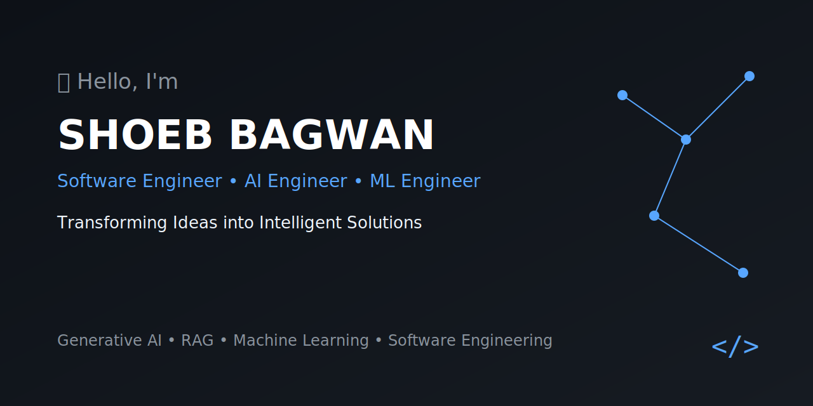

  

<h1 align="center">Hi 👋, I'm Shoeb Bagwan</h1>

<h3 align="center">AI/ML Engineer | CSE (AI & ML) Graduate | Python Developer</h3>

  

---

## 👨‍💻 About Me

- 🎓 B.E. Computer Science (AI & ML) — Class of 2026, Mumbai
- 🧠 Focused on: RAG systems, NLP, Speech Emotion Recognition & ML applications
- 💼 6 months internship experience in AI/ML at Internship Studio
- 🎯 Targeting roles: Junior ML Engineer | AI Engineer | NLP Engineer | Data Scientist
- 📫 Reach me: [LinkedIn](https://www.linkedin.com/in/shoeb-bagwan-75b15537b/)

---

## 🛠️ Tech Stack

  

  
  
  
  
  
  
  
  
  

---

## 🚀 Featured Projects

| Project | Description | Tech |
|--------|-------------|------|
| [RAG Chatbot](https://github.com/shoebbagwan/rag-chatbot) | PDF chatbot using RAG — answers questions strictly from your document, no hallucinations | LangChain, Gemini, FAISS, Streamlit |
| [ChargePath](https://github.com/shoebbagwan/chargepath) | Full-stack EV charging station finder with live availability on an interactive map | React, Node.js, Leaflet.js |
| [Vocal Metrics — SER](https://github.com/shoebbagwan/vocal-metrics-SER) | Detects 8 human emotions from raw audio waveforms — operates on sound physics, not text | PyTorch, FastAPI, React |
| [AttireAI](https://github.com/shoebbagwan/ai-cloth-recommender) | Personal AI style advisor that recommends outfits based on body type, weather & occasion | React, FastAPI, Scikit-learn, SQLite |

---

## 📊 Most Used Languages

  

## 🔥 GitHub Streak

  

---

## 🐍 My Contributions

<picture>
  <source media="(prefers-color-scheme: dark)" srcset="https://raw.githubusercontent.com/shoebbagwan/shoebbagwan/output/github-contribution-grid-snake-dark.svg">
  <source media="(prefers-color-scheme: light)" srcset="https://raw.githubusercontent.com/shoebbagwan/shoebbagwan/output/github-contribution-grid-snake.svg">
  
</picture>
